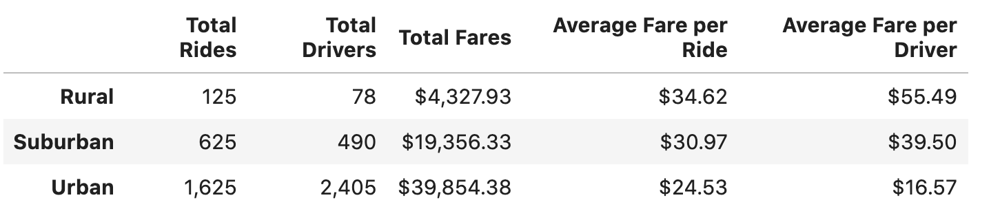

# Pyber_Analysis
# Overview of the analysis 
This analysis was performed to understand how Pyber is used among different types of cities and how fares and drivers compare between them.  I was also interested to find out how Pyber could change their strategy in different city types that may allow for larger utilization.

# Results 

Based on the table and chart above, we can see that Pyber is utilized much more within urban cities than either suburban or rural cities.  Because of such high utilization and an abundance of drivers coupled with shorter distances to travel, urban cities tend have lower average fares per ride and lower average fares per driver.  Theoretically, rides in suburban and rural areas will tend to be longer which, in turn, driving up the fare cost.

# Summary
Based on the results above, I think Pyber can increase utilization in both rural and suburban cities if they make any of the following changes in their strategy:

1. Because rural and suburban rides tend to be longer than urban rides, we recommend cutting the cost of rides per mile to make it more affordable for customers in those cities and also potentially drive up Pyber usage.

2. Without the constant visibility of Pyber's brand throughout suburban and rural areas, it's likely that customers don't often think about Pyber. I recommend that Pyber start an email campaign in these cities to give out free or discounted ride promo codes to get customers thinking about Pyber as a ride option.

3. The same sort of campaign can be done to increase Pyber drivers, as well.  Pyber can create some sort of incentive to attract drivers and also create more visibility within rural and suburban areas.
